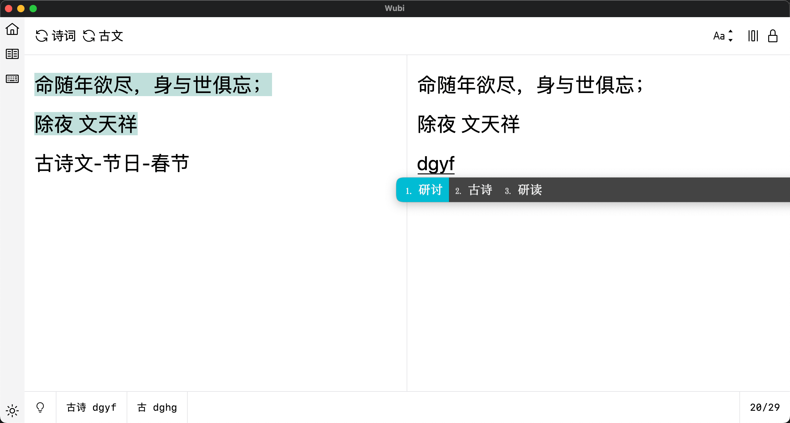
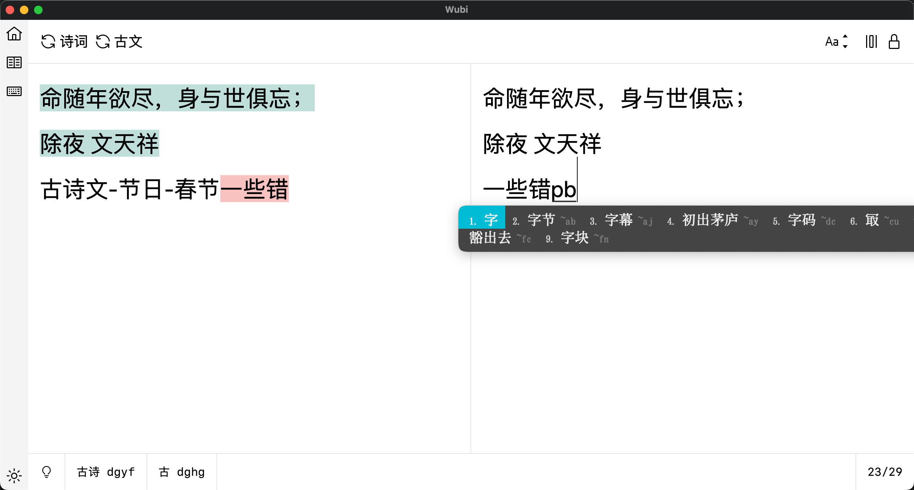
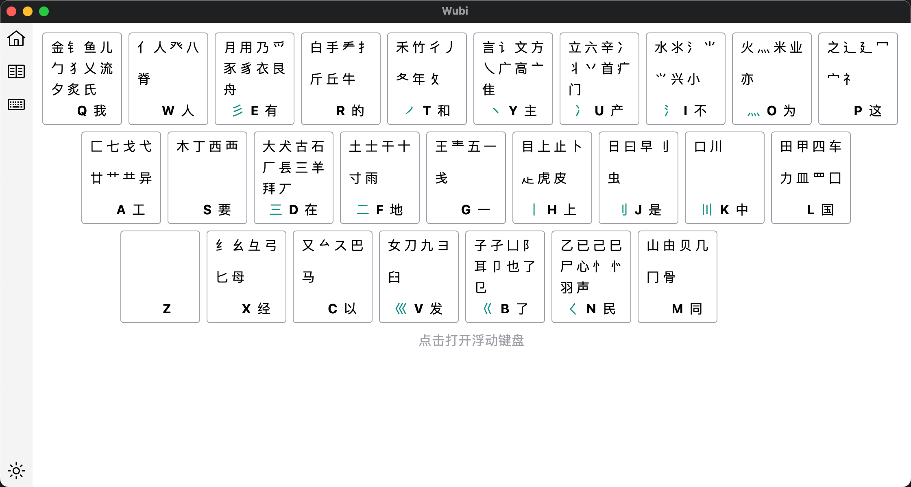
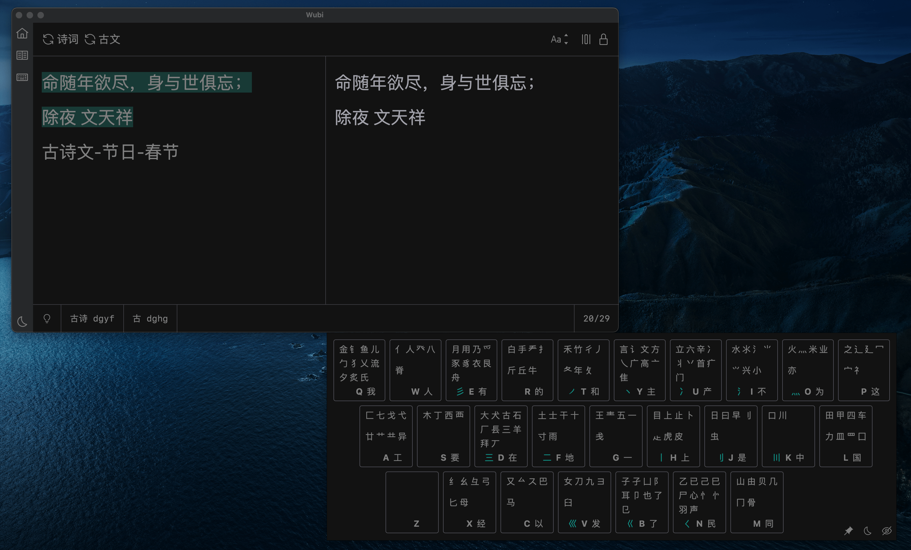

# Tauri wubi (WIP)

A tool for practicing wubi input method.

## Overview

Basic usage



Wrong characters



Keyboard



Dark mode



## Dependences

Tauri + Vue + Vite

## Dev

```shell
pnpm install
pnpm tauri dev
```

## Usage

It is recommended that you use the input method [Rime](https://rime.im).

## Data source

- Wubi: rime input schema [wubi86](https://github.com/rime/rime-wubi)
- Poems: [jinrishici](https://www.jinrishici.com/)
- Chinese Prose: [ctext.org](https://ctext.org/zhs)
